<a id="topo"></a>

<div align="center">

# 🚀 Primeira Pipeline CI/CD

<p>
  
  
  
  
  
</p>

<p>
  <strong>Projeto demonstrativo de CI/CD com Go, Docker, GitHub Actions, self-hosted runner e Kubernetes local.</strong>
</p>

<p>
  Este repositório foi estruturado para demonstrar habilidades práticas de automação, conteinerização, deploy contínuo,
  troubleshooting de pipeline e operação de aplicações em cluster local.
</p>

</div>

> [!IMPORTANT]
> Este projeto tem um objetivo claro de portfólio técnico: mostrar que eu consigo sair do código-fonte até o deploy automatizado,
> passando por build de imagem, gestão de credenciais, runner self-hosted e validação de rollout em Kubernetes.

<a id="indice"></a>

## 📚 Índice

- [🎯 Visão Geral](#visao-geral)
- [✨ O que este projeto demonstra](#o-que-este-projeto-demonstra)
- [🏗️ Arquitetura e fluxo](#arquitetura-e-fluxo)
- [🧰 Stack utilizada](#stack-utilizada)
- [📁 Estrutura do repositório](#estrutura-do-repositorio)
- [⚙️ Aplicação Go](#aplicacao-go)
- [🐳 Build da imagem Docker](#build-da-imagem-docker)
- [☸️ Deploy no Kubernetes](#deploy-no-kubernetes)
- [🔄 Pipeline CI/CD](#pipeline-cicd)
- [🧪 Teste manual da aplicação](#teste-manual-da-aplicacao)
- [✅ Evidências de validação](#evidencias-de-validacao)
- [🗣️ Como apresentar este projeto em entrevistas](#como-apresentar-este-projeto-em-entrevistas)
- [🚀 Como executar localmente](#como-executar-localmente)
- [📈 Próximas evoluções](#proximas-evolucoes)

<a id="visao-geral"></a>

## 🎯 Visão Geral

Este projeto entrega uma aplicação HTTP simples em Go, empacotada em uma imagem Docker e publicada automaticamente no Docker Hub.
Depois do build, o pipeline executa o deploy em um cluster Kubernetes local via `kubectl`, usando um runner self-hosted configurado
na própria máquina que hospeda o cluster.

Na prática, este repositório mostra:

- pipeline completa de `CI` e `CD`
- build de imagem com Docker multi-stage
- autenticação segura com `secrets` e `variables`
- deploy automatizado em cluster local
- validação de rollout no Kubernetes
- troubleshooting real de integração entre GitHub Actions, Docker Hub e runner self-hosted

<p align="right"><a href="#indice">⬆️ Voltar ao índice</a></p>

<a id="o-que-este-projeto-demonstra"></a>

## ✨ O que este projeto demonstra

- **Automação ponta a ponta**: do `push` na `main` até a atualização da imagem em execução no cluster.
- **Conhecimento de containers**: build de imagem otimizada com Docker multi-stage.
- **Operação de CI/CD realista**: separação entre job de `CI` e job de `CD`.
- **Uso correto de credenciais**: integração com Docker Hub via `DOCKERHUB_USERNAME` e `DOCKERHUB_TOKEN`.
- **Execução híbrida**: `CI` em `ubuntu-latest` e `CD` em runner self-hosted com acesso ao cluster local.
- **Kubernetes na prática**: `Deployment`, `Service`, rollout e verificação pós-deploy.
- **Capacidade de debugging**: correção de falhas de autenticação e de orquestração do runner.

<p align="right"><a href="#indice">⬆️ Voltar ao índice</a></p>

<a id="arquitetura-e-fluxo"></a>

## 🏗️ Arquitetura e fluxo

```mermaid
flowchart LR
    A[Push ou merge na main] --> B[GitHub Actions - CI]
    B --> C[Build da imagem Docker]
    C --> D[Push para Docker Hub]
    D --> E[GitHub Actions - CD]
    E --> F[Runner self-hosted local]
    F --> G[kubectl apply]
    G --> H[Cluster Kubernetes local - k3d]
    H --> I[Deployment web]
    I --> J[Service web]
    J --> K[Teste manual via port-forward]
```



### Fluxo resumido

1. O código é versionado no GitHub.
2. O workflow em [`.github/workflows/main.yml`](.github/workflows/main.yml) inicia a etapa de `CI`.
3. A aplicação é empacotada em imagem Docker e enviada ao Docker Hub com tag versionada.
4. O job de `CD` roda em um runner self-hosted com acesso ao cluster local.
5. O manifesto Kubernetes é atualizado com a nova tag da imagem.
6. O deploy é aplicado com `kubectl`.
7. O rollout é validado automaticamente ao final do pipeline.

<p align="right"><a href="#indice">⬆️ Voltar ao índice</a></p>

<a id="stack-utilizada"></a>

## 🧰 Stack utilizada

| Camada | Tecnologia | Objetivo |
| --- | --- | --- |
| Aplicação | Go 1.22 | Servir uma resposta HTTP simples |
| Containerização | Docker | Build e empacotamento da aplicação |
| Registro de imagens | Docker Hub | Armazenar imagens versionadas |
| CI/CD | GitHub Actions | Automatizar build, push e deploy |
| Execução do deploy | Self-hosted runner | Rodar o `kubectl` próximo ao cluster |
| Orquestração | Kubernetes | Executar a aplicação em cluster |
| Cluster local | k3d | Ambiente local leve para demonstração |

<p align="right"><a href="#indice">⬆️ Voltar ao índice</a></p>

<a id="estrutura-do-repositorio"></a>

## 📁 Estrutura do repositório

| Caminho | Finalidade |
| --- | --- |
| [`src/main.go`](src/main.go) | Código-fonte da aplicação Go |
| [`src/Dockerfile`](src/Dockerfile) | Build multi-stage da imagem |
| [`k8s/deployment.yaml`](k8s/deployment.yaml) | `Deployment` e `Service` da aplicação |
| [`.github/workflows/main.yml`](.github/workflows/main.yml) | Pipeline de CI/CD |

<p align="right"><a href="#indice">⬆️ Voltar ao índice</a></p>

<a id="aplicacao-go"></a>

## ⚙️ Aplicação Go

A aplicação é propositalmente simples para deixar o foco do projeto na esteira de entrega. Ela sobe um servidor HTTP na porta `5000`
e responde texto puro no endpoint raiz:

```txt
Aplicacao exemplo
```

Esse recorte é importante para portfólio: o valor deste repositório não está na complexidade de regra de negócio,
mas sim na demonstração de domínio sobre pipeline, build, deploy e operação local.

<p align="right"><a href="#indice">⬆️ Voltar ao índice</a></p>

<a id="build-da-imagem-docker"></a>

## 🐳 Build da imagem Docker

O arquivo [`src/Dockerfile`](src/Dockerfile) usa **multi-stage build**:

- a primeira etapa compila a aplicação em Go
- a segunda etapa cria uma imagem final mais enxuta
- a execução acontece com um usuário não-root (`appuser`)

Esse desenho ajuda a demonstrar preocupação com:

- tamanho da imagem
- separação entre build e runtime
- segurança básica de execução

<p align="right"><a href="#indice">⬆️ Voltar ao índice</a></p>

<a id="deploy-no-kubernetes"></a>

## ☸️ Deploy no Kubernetes

O arquivo [`k8s/deployment.yaml`](k8s/deployment.yaml) define:

- um `Deployment` chamado `web`
- uma réplica da aplicação
- um `Service` exposto na porta `80`
- encaminhamento para a aplicação na porta `5000`

### Observação importante sobre ambiente local

Como o cluster roda localmente com `k3d` em ambiente WSL, o `Service` do tipo `LoadBalancer` pode ficar com `EXTERNAL-IP <pending>`.
Por isso, o método mais confiável para teste manual local é usar `kubectl port-forward`.

<p align="right"><a href="#indice">⬆️ Voltar ao índice</a></p>

<a id="pipeline-cicd"></a>

## 🔄 Pipeline CI/CD

O workflow em [`.github/workflows/main.yml`](.github/workflows/main.yml) está dividido em dois jobs:

### Job `CI` — Build e Push da imagem Docker

- roda em `ubuntu-latest`
- valida se as credenciais do Docker Hub estão configuradas
- faz autenticação no registry
- builda a imagem a partir de `./src`
- publica duas tags:
  - `v${{ github.run_number }}`
  - `latest`

### Job `CD` — Deploy no Kubernetes

- roda em `self-hosted`
- depende do sucesso do job `CI`
- atualiza o manifesto com a tag versionada da imagem
- aplica o deploy com `kubectl apply`
- valida a atualização com `kubectl rollout status`

### Por que esse desenho é interessante para recrutadores?

- mostra entendimento de separação entre build e deploy
- mostra uso consciente de runner hospedado e runner local
- demonstra integração entre pipeline em nuvem e infraestrutura local
- evidencia capacidade de resolver gargalos reais de autenticação e execução

<p align="right"><a href="#indice">⬆️ Voltar ao índice</a></p>

<a id="teste-manual-da-aplicacao"></a>

## 🧪 Teste manual da aplicação

Este fluxo foi validado manualmente no cluster local.

### 1. Confirmar o rollout

```bash
kubectl rollout status deployment/web
```

### 2. Verificar a imagem em execução

```bash
kubectl get deployment web -o jsonpath='{.spec.template.spec.containers[0].image}'
```

### 3. Abrir acesso local ao Service

```bash
kubectl port-forward svc/web 18080:80
```

### 4. Testar a aplicação via HTTP

```bash
curl -i http://127.0.0.1:18080
```

### Resposta esperada

```http
HTTP/1.1 200 OK
Content-Type: text/plain

Aplicacao exemplo
```

### Diagnóstico adicional útil

```bash
kubectl get deployment web -o wide
kubectl get pods -l app=web -o wide
kubectl get svc web -o wide
```

<p align="right"><a href="#indice">⬆️ Voltar ao índice</a></p>

<a id="evidencias-de-validacao"></a>

## ✅ Evidências de validação

- [x] Pipeline de `CI` executando build e push da imagem com sucesso
- [x] Pipeline de `CD` executando deploy automático no cluster local
- [x] Runner self-hosted configurado para o repositório
- [x] Rollout validado no Kubernetes
- [x] Aplicação respondendo com `HTTP 200 OK`
- [x] Teste manual confirmado via `port-forward`

### Resultado operacional esperado

- a `main` dispara a pipeline automaticamente
- uma nova imagem é publicada no Docker Hub
- o cluster recebe a nova versão
- a aplicação permanece acessível localmente para validação

<p align="right"><a href="#indice">⬆️ Voltar ao índice</a></p>

<a id="como-apresentar-este-projeto-em-entrevistas"></a>

## 🗣️ Como apresentar este projeto em entrevistas

Se eu estivesse defendendo este projeto em uma conversa técnica, eu destacaria:

- **Objetivo**: construir uma esteira enxuta, mas real, para demonstrar domínio prático de CI/CD.
- **Desafio principal**: integrar GitHub Actions com Docker Hub e com um cluster Kubernetes local.
- **Decisão arquitetural**: usar `ubuntu-latest` no `CI` e `self-hosted` no `CD`, porque o cluster é local e não está acessível por um runner hospedado.
- **Aprendizado operacional**: runner local, credenciais, fila de jobs, rollout e validação HTTP.
- **Resultado**: aplicação publicada, deploy automatizado e fluxo reproduzível para demonstração.

Esse tipo de narrativa costuma mostrar mais maturidade do que simplesmente dizer "eu sei Docker" ou "eu sei Kubernetes".

<p align="right"><a href="#indice">⬆️ Voltar ao índice</a></p>

<a id="como-executar-localmente"></a>

## 🚀 Como executar localmente

### Rodar a aplicação em Go

```bash
cd src
go run .
```

### Buildar a imagem Docker

```bash
docker build -t primeira-pipeline-cicd:local ./src
```

### Rodar a imagem localmente

```bash
docker run --rm -p 5000:5000 primeira-pipeline-cicd:local
```

### Testar localmente fora do cluster

```bash
curl http://127.0.0.1:5000
```

### Acessar o fluxo no GitHub

- [GitHub Actions](https://github.com/brodyandre/primeira-pipeline-cicd/actions)
- [Workflow principal](.github/workflows/main.yml)
- [Manifesto Kubernetes](k8s/deployment.yaml)

<p align="right"><a href="#indice">⬆️ Voltar ao índice</a></p>

<a id="proximas-evolucoes"></a>

## 📈 Próximas evoluções

Algumas melhorias que deixariam este projeto ainda mais forte:

- adicionar testes automatizados da aplicação antes do build da imagem
- incluir `livenessProbe` e `readinessProbe` no `Deployment`
- adotar `Helm` ou `Kustomize` para gerenciamento de manifests
- separar ambientes de `dev`, `staging` e `prod`
- publicar métricas e logs estruturados
- automatizar estratégia de rollback

<p align="right"><a href="#indice">⬆️ Voltar ao índice</a></p>

---

<div align="center">
  <strong>Feito para demonstrar engenharia de entrega, não apenas "subir uma aplicação".</strong><br>
  <sub>Se este repositório chamar a atenção de um recrutador, ele cumpriu bem o seu papel. ✨</sub>
</div>
